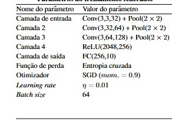
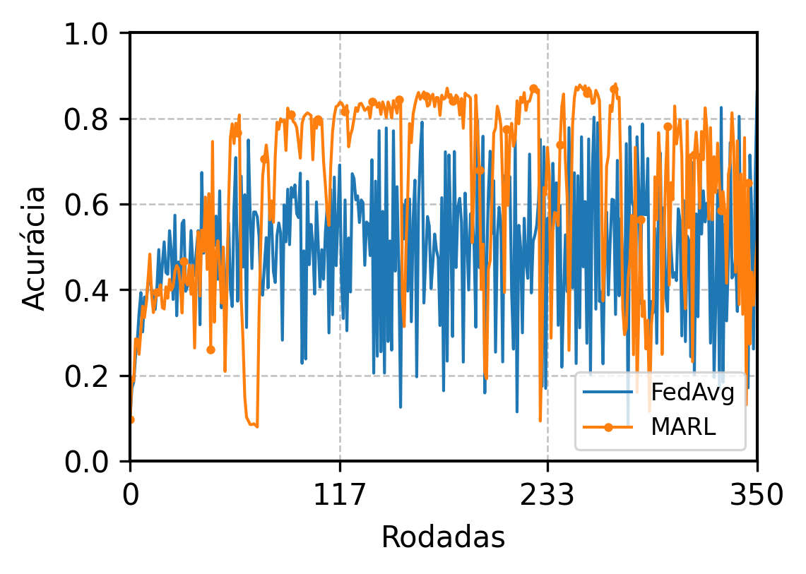
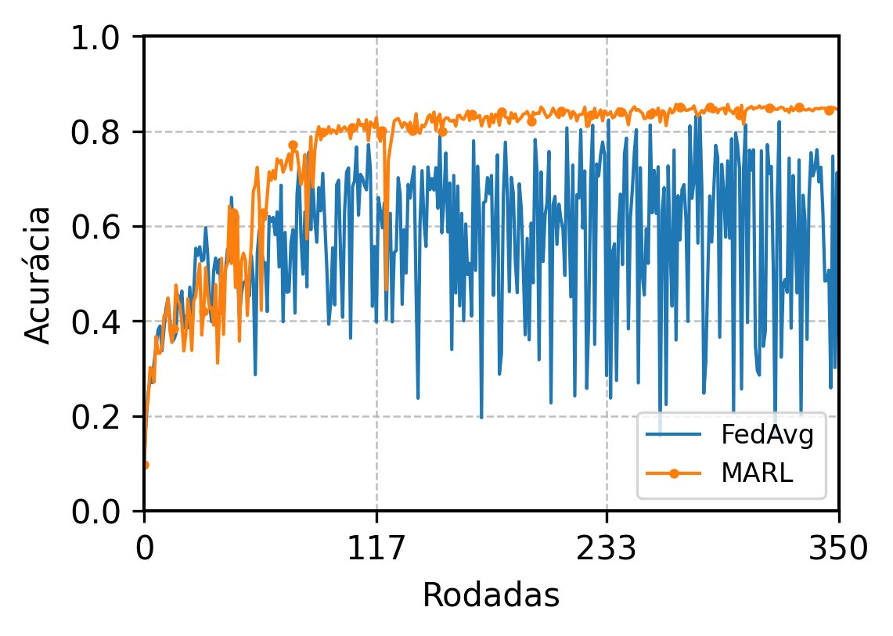

ClientSelection — Seleção de Clientes Federados usando Aprendizado por Reforço Multiagente

Este repositório contém a implementação de um mecanismo de seleção de clientes para *Aprendizado Federado (FL)* baseado em *Aprendizado por Reforço Multi-Agente (MARL)*, utilizando *Value Decomposition Networks (VDN)*, com foco em robustez contra ataques do tipo label flipping.


---

## Descrição do Projeto

Em cenários de aprendizado federado, a seleção dos clientes que participam de cada rodada de agregação impacta diretamente a qualidade e a robustez do modelo global. Clientes maliciosos podem degradar o desempenho do modelo ao enviar atualizações envenenadas.

Este projeto propõe o uso de agentes de **aprendizado por reforço multi-agente** para aprender a selecionar clientes de forma adaptativa, evitando atacantes e priorizando clientes honestos com base em métricas de contribuição .

### Componentes principais

- **VDN (Value Decomposition Networks)** com Double DQN e Prioritized Experience Replay (PER) para seleção de clientes
- **Métricas de estado do agente**: projeção de gradiente (proj), perda de generalização (gener), estagnação (estag) e série de seleções (serie)
- **Ataque**: *Targeted Label Flipping* determinístico com fração configurável de atacantes
- **Mecanismo de agregação**: FedAvg
- **Distribuição de dados**: Dirichlet não-IID com alpha configurável

### Arquitetura do experimento

Cada rodada é dividida em duas fases:

1. **Fase de métricas** — todos os 50 clientes treinam por `local_steps` passos curtos. As métricas (`proj`, `gener`) são calculadas e usadas como variáveis de estado.
2. **Fase de treino** — apenas os K clientes selecionados pelo agente treinam por `local_epochs` épocas completas. Os deltas são agregados via FedAvg


## Métricas de estado do agente

O vetor de observação de cada cliente $i$ na rodada $t$ é composto pelas métricas:

**Projeção de gradiente** 

$$\text{proj}_{i,t} = \Delta w_i^\top \cdot \hat{m}_t$$

$$m_t = \beta m_{t-1} + (1-\beta)\nabla_{w_t}\mathcal{L}(w_t; \mathcal{D}^{val}), \qquad \hat{m}_t = \frac{-m_t}{\|m_t\| + \epsilon}$$

**Perda de generalização** 

$$\text{gener}_{i,t} = \frac{1}{|\mathcal{D}|}\sum_{j=1}^{|\mathcal{D}|} \mathcal{L}\left(\hat{y}_{i,t}^{(j)}, y_{i,t}^{(j)}\right)$$

**Estagnação** — 

$$\text{estag}^^{\ast}_{i,t} = \frac{\text{estag}_{i,t}}{\max_{j \neq i}\, \text{estag}_{j,t} + \epsilon}$$

**Série de seleções** — 

$$\text{serie}^^{\ast}_{i,t} = \min\left(\frac{\text{serie}_{i,t}}{\text{serie}^{(\max)}}, 1\right)$$


---


### Clone o repositório

```bash
git clone https://github.com/braiton1277/ClientSelection.git
```

### Instalação
```bash
pip install -r requirements.txt
```


---

## Como Rodar

### Execução padrão

```bash
python main.py
```

### Configuração principal (`main.py`)

Os principais hiperparâmetros são passados diretamente para `run_experiment()`:

```python
run_experiment(
    rounds=350,
    n_clients=50,
    k_select=15,
    dir_alpha=0.3,
    run_random=True,       # roda track de seleção aleatória
    run_vdn=True,          # roda track VDN
    initial_flip_fraction=0.4,
    flip_rate_initial=1.0,    
    local_lr=0.005,
    local_steps=10,
    local_epochs=5,
    marl_lr=1e-4,
)
```

Os resultados são salvos automaticamente em um arquivo `.json` no diretório de saída configurado.

---

## Estrutura dos Arquivos

```
ClientSelection/
+-- main.py           # ponto de entrada, configuração dos hiperparâmetros
+-- experiment.py     # loop principal do experimento (tracks RANDOM e VDN)
+-- server.py         # treino local, agregação, métricas de servidor
+-- agent.py          # VDNSelector, AgentMLP, PrioritizedReplayJoint
+-- metrics.py        # eval_acc, eval_loss, probing_loss, windowed_reward
+-- data.py           # split Dirichlet
+-- model.py          # ResNet18 adaptada para CIFAR-10
+-- config.py         # DEVICE, SEED, seed_worker
+-- flower/           # implementação experimental com Flower 1.26 (em desenvolvimento)
    +-- pyproject.toml
    +-- vdn_fl/
        +-- client_app.py
        +-- server_app.py
        +-- data.py
        +-- ...
```

---

## Evolução do Modelo

O projeto passou por três etapas principais de desenvolvimento, cada uma evidenciando limitações e motivando as melhorias seguintes. Os exemplos a seguir adotam a mesma configuração base: N = 50 clientes, K = 15 selecionados por rodada, 40% de clientes atacantes com inversão total dos rótulos (100% de label flipping).

### Etapa 1 — SmallCNN

A versão inicial utilizava uma CNN simples (SmallCNN):

| Camada | Configuração |
|---|---|
| Entrada | Conv(3,3,32) + Pool(2×2) |
| Camada 2 | Conv(3,32,64) + Pool(2×2) |
| Camada 3 | Conv(3,64,128) + Pool(2×2) |
| Saída | FC(2048, 256, 10) |
| Otimizador | SGD (momentum=0.9, lr=0.01) |

Com essa arquitetura o agente VDN já demonstrou superioridade sobre a seleção aleatória (FedAvg), atingindo ~67% de acurácia contra ~55% do FedAvg com 40% dos clientes atacantes ao longo de 500 rodadas. A rede pequena, por gerar deltas de menor magnitude, apresentava estabilidade natural contra ataques.



---

### Etapa 2 — ResNet18 sem mecanismos de estabalização

A substituição pela ResNet18 adaptada para CIFAR-10 (conv1 3×3, sem maxpool, BatchNorm padrão) visava aumentar a capacidade do modelo e aproximar os resultados do estado da arte. Porém, sem mecanismos de estabilização, os deltas de maior magnitude da ResNet18 amplificavam drasticamente o impacto dos atacantes, causando quedas bruscas e recorrentes de acurácia que tornavam o treinamento instável.



---

### Etapa 3 — ResNet18 com FedMedian + Norm Filtering + Clipping

A adição de três mecanismos de defesa na agregação resolveu a instabilidade:

| Mecanismo | Configuração | Efeito |
|---|---|---|
| Norm filtering | `2.0 × median_norm` | Remove deltas com norma anômala antes da agregação |
| Gradient clipping | `0.25 × median_norm` | Limita a magnitude total da atualização por rodada |
| FedMedian | — | Agrega pela mediana |

Com essas defesas, o agente VDN mantém acurácia estável em torno de **85%** ao longo de 350 rodadas, mantendo a seleção dos clientes honestos, enquanto o FedAvg com seleção aleatória oscila continuamente devido à presença dos atacantes.




A cada 20 rodadas, é impresso o ranking dos clientes ordenado pela vantagem (`adv = Q1 - Q0`). Clientes com `adv` positivo são priorizados na seleção. O resultado abaixo ilustra a separação aprendida pelo MARL, demonstrando que a seleção prioriza os honestos:

| Posição   | Cliente   |   Tipo    |     adv    |
|-----------|-----------|-----------|------------|
| 1º        | 41        |  HONEST   |  +0.083774 |
| 2º        | 06        |  HONEST   |  +0.074431 |
| 3º        | 23        |  HONEST   |  +0.070137 |
| 4º        | 24        |  HONEST   |  +0.068502 |
| ...       | ...       |   ...     |     ...    |
| 47º       | 12        | ATTACKER  |  -0.144135 |
| 48º       | 31        | ATTACKER  |  -0.142081 |
| 49º       | 12        | ATTACKER  |  -0.144135 |
| 50º       | 30        | ATTACKER  |  -0.187876 |


---


